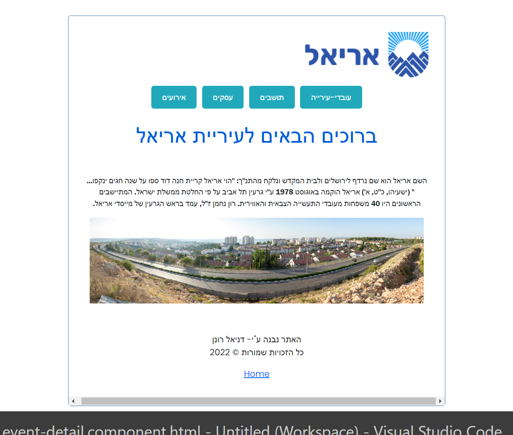
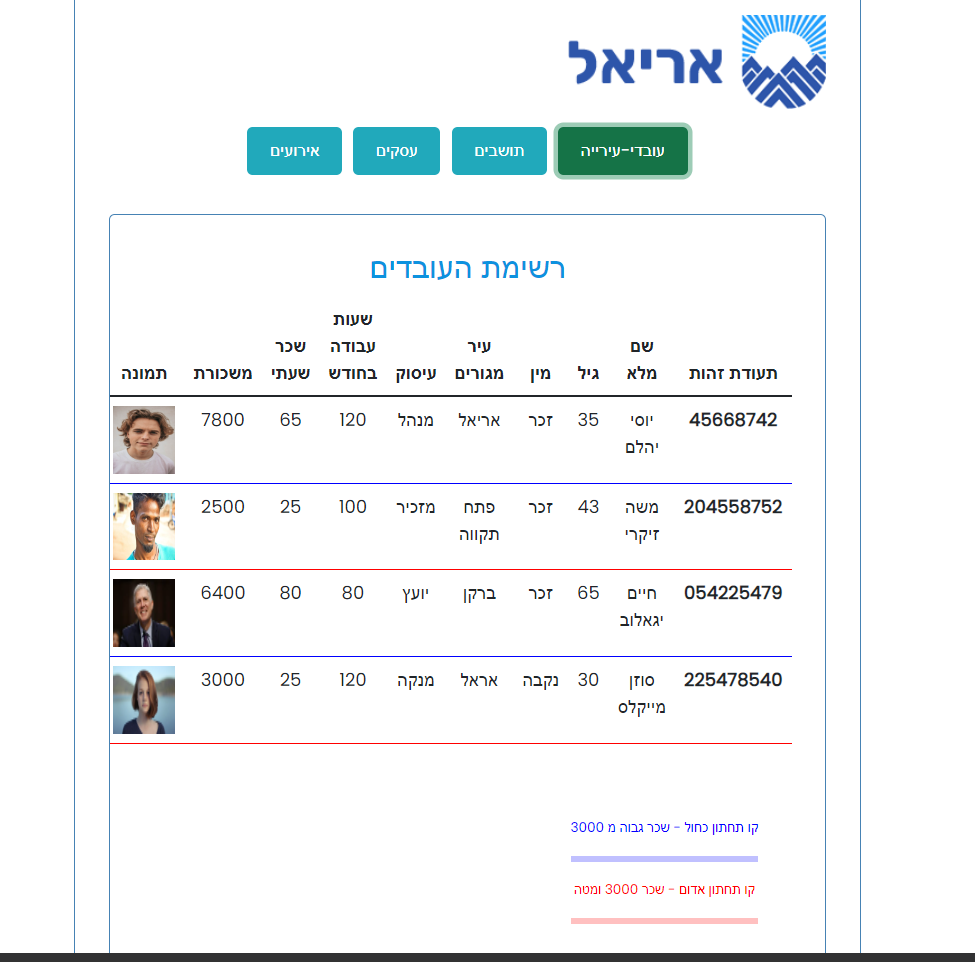
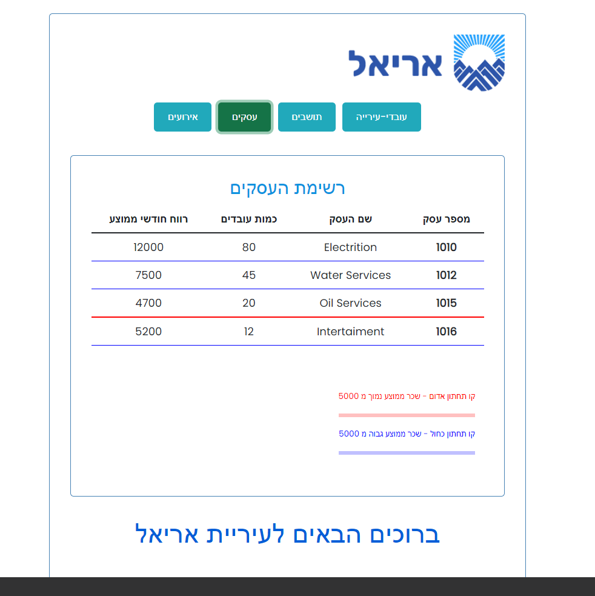
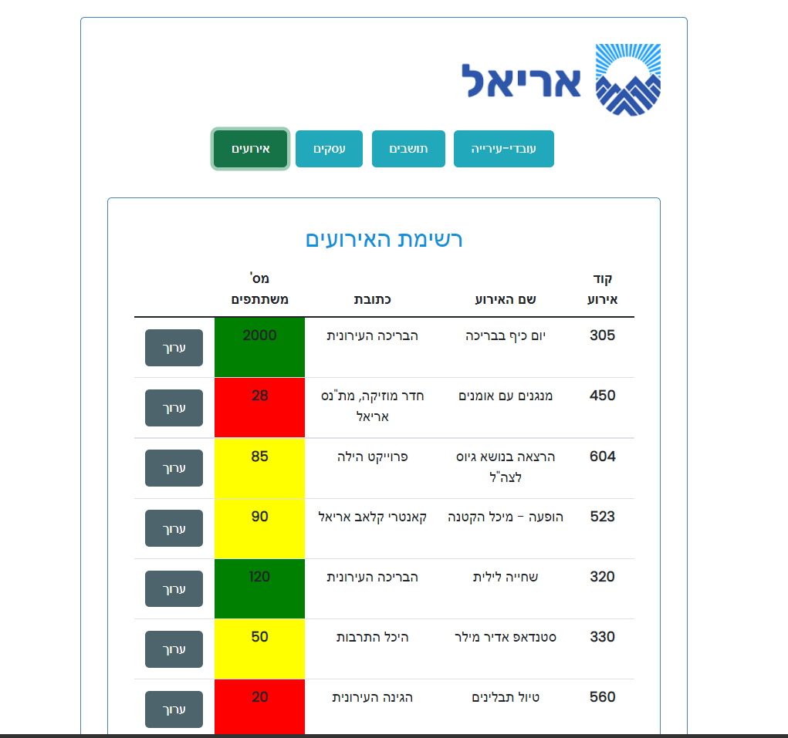
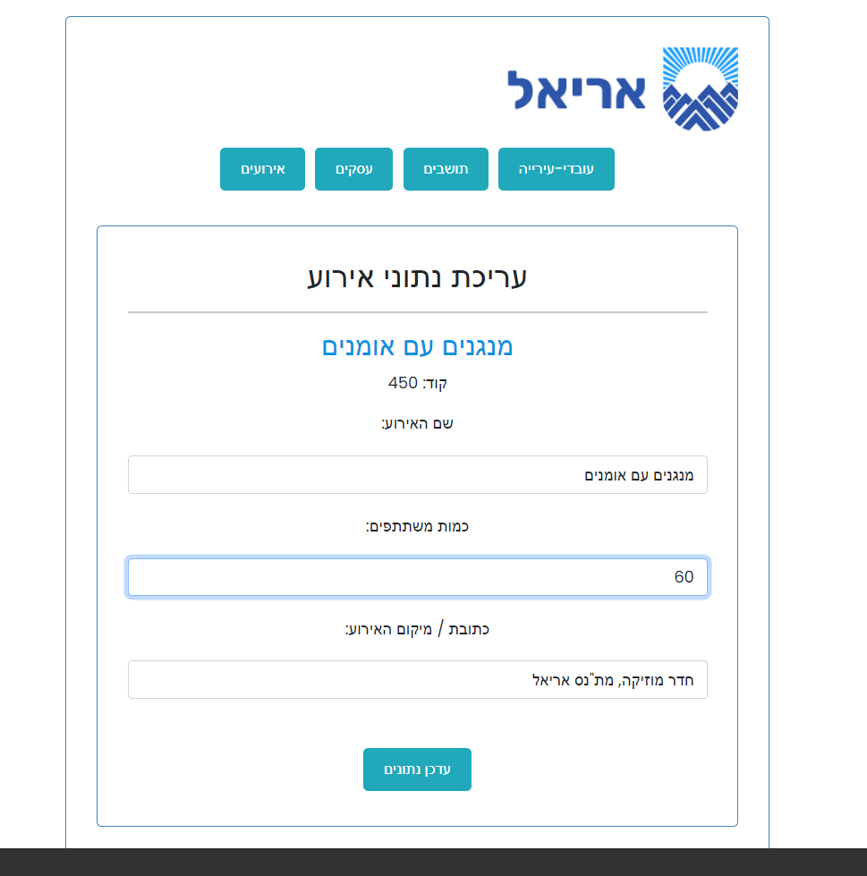
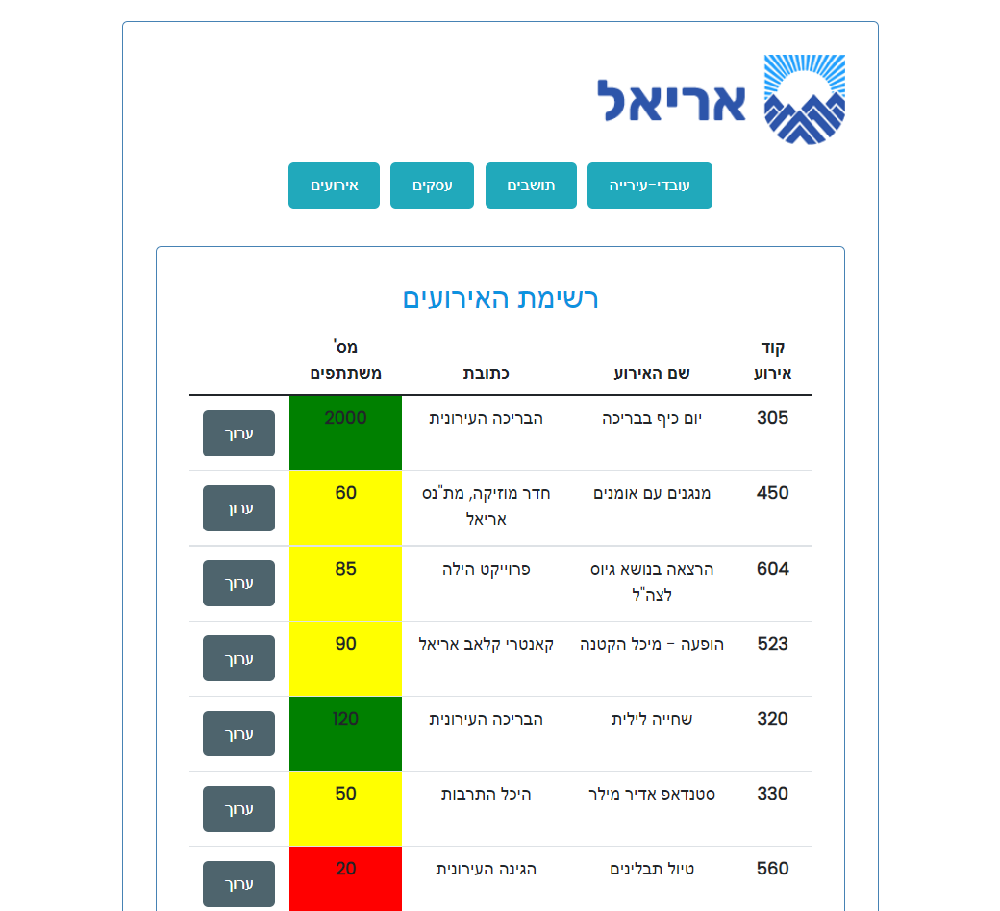

# Municipal Web App

A municipal web app for Angular course bonus task.

The City's app is Israeli so all the content in hebrew and rtl.

[Link for github pages](https://danielronen.github.io/Municipl-Web-App-Angular/) 

## <ins>Home page</ins>

## <ins>City workers table</ins>

## <ins>Bussinesses list</ins>

## <ins>Events list</ins>
with option to edit the data of the event

## <ins>example</ins>

its uploanding the data automaticli

## Install Dependencies
Run `npm install` for install project dependencies.

## Build

Run `ng build` to build the project. The build artifacts will be stored in the `dist/` directory.

## Running 

Run `ng serve` for a dev server. Navigate to `http://localhost:4200/`. The application will automatically reload if you change any of the source files.

#### &copy; 2022 All rights reserved to Daniel Ronen. 
